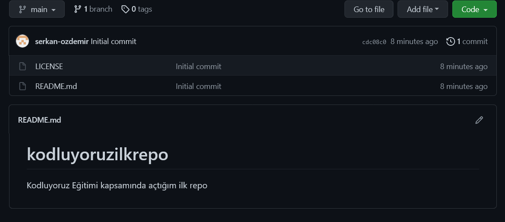

# kodluyoruzilkrepo
Bu repo [Kodluyoruz](https://www.kodluyoruz.org) Eğitimi kapsamında açtığım ilk repo , içerisinde bir adet README.md, bir adet de index.html barındırıyor.

##Installation
Öncelikle projeyi clonelayın. (Buraya sizin reponuzdan aldığınız link gelecek)

    git clone https://github.com/serkan-ozdemir/kodluyoruzilkrepo.git

##Usage
Projeyi cloneladıktan sonra Visual Studio Code programında açınız.

Linux için:

    cd kodluyoruzilkrepo
    code .

##Contributing

Pull requestler kabul edilir. Büyük değişiklikler için, lütfen önce neyi değiştirmek istediğinizi tartışmak için bir konu açınız.

##License
[MIT](https://choosealicense.com/licenses/mit/)